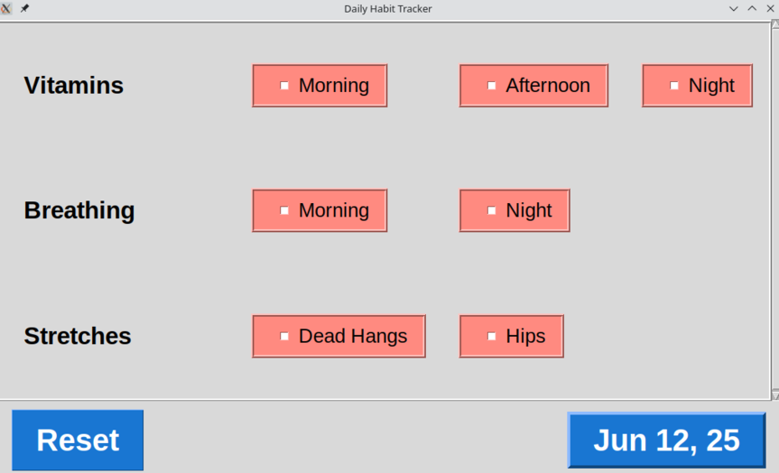

# FitzPi Habits Tracker

A simple, elegant daily habit tracker designed for Raspberry Pi touchscreen devices. This project was an opportunity to practice collaborative coding with an AI assistant, leveraging modern tools to build a practical, real-world application.

## Purpose

The FitzPi Habits Tracker helps you build and maintain daily habits. Place your Raspberry Pi with a touchscreen on your desk, and easily check off habits as you complete them throughout the day. The app provides a clear, interactive interface for tracking progress and staying accountable.



## Features

- Touch-friendly interface for Raspberry Pi screens
- Customizable habits and sub-items via CSV file
- Daily reset and progress tracking
- Persistent data storage for habit history
- Visual feedback for completed habits

## How It Works

1. **Setup**: Define your habits and sub-items in a CSV file. The app reads this file on startup.
2. **Daily Use**: Each day, check off habits as you complete them using the touchscreen interface.
3. **Data Storage**: The app saves your progress in a local JSON file, recording each day's state and timestamp.
4. **Reset**: At midnight (or manually), the tracker resets for a new day, preserving your history.

## Data Storage

- **Habits CSV**: Configure your habits in a CSV file (path set via the `HABITS_CSV_PATH` environment variable).
- **Habit Data**: Progress is saved in `habit_data.json` as newline-delimited JSON records, allowing you to review your habit history over time.

## Getting Started

1. Clone the repository.
2. Install dependencies:  
   `pip install -r requirements.txt`
3. Create a `.env` file with the path to your habits CSV:  
   `HABITS_CSV_PATH=/path/to/your/habits.csv`
4. Run the app:  
   `python habits.py`

### Create Desktop Shortcut (Optional)

To run your Tkinter app on a touchscreen, the best approach is to create a desktop shortcut that launches your script in fullscreen mode. This makes it easy to start with a single tap.


1. **Create a desktop shortcut** (`.desktop` file) in `~/Desktop/fitzpi-habits.desktop`:

```ini
[Desktop Entry]
Type=Application
Name=Habit Tracker
Exec=python3 /path/to/habits.py
Icon=utilities-terminal
Terminal=false
```
Replace `/path/to/habits.py` with the actual path.

2. **Make the shortcut executable:**
```bash
chmod +x ~/Desktop/fitzpi-habits.desktop
```

Now you can launch your app in fullscreen with a single tap on the touchscreen.

## License

MIT License

---

_Created with the help of an AI programming assistant._